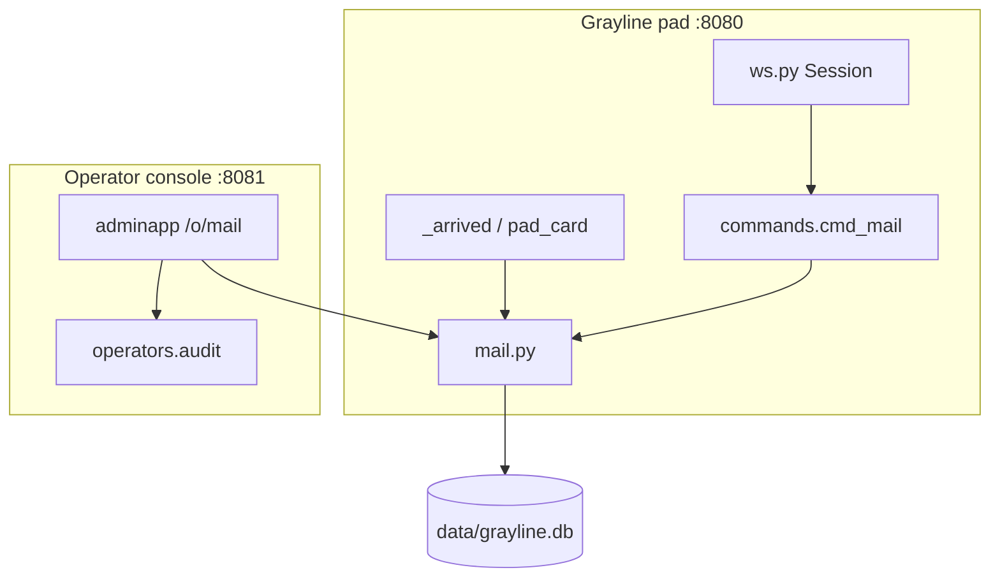
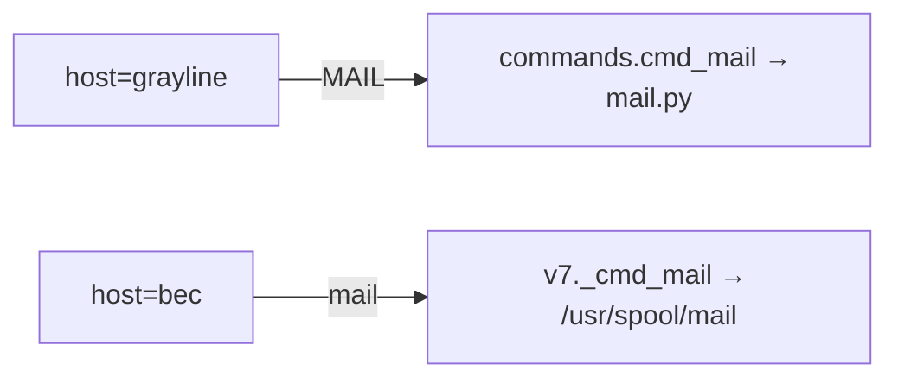

# Grayline System Mail (Pad-Local)

| Field | Value |
| --- | --- |
| **Author** | jws |
| **Date** | 2026-10-01 |
| **Status** | Ready for implementation |
| **Workspace** | `/Volumes/External Drive/coding/crossbar` |

---

## Overview

Grayline registered users need a pad-local mailbox: compose, send, read, reply, forward, delete, and archive letters between handles, plus sysop/operator broadcasts. Today `cmd_mail` in [`crossbar/commands.py`](crossbar/commands.py) is a dead stub (`"no letters.\r\n"`) that is **not** listed in `_GRAYLINE_COMMANDS`, so `mail` on the pad returns `not found` (asserted by `tests/test_app.py`). The BEC door already has a separate Unix-style `mail` that reads `/usr/spool/mail` inside the V7 tree — pad MAIL must never collide with that path.

This design adds SQLite-backed pad mail in `data/grayline.db`, a grayline-only `MAIL` verb with subcommands and a short compose phase, login-time unread notification after `CIRCUIT OPEN`, and an operator-console broadcast tool that sends as the non-login system sender `sysop`. No SMTP or Internet email bridge in v1. The account `email` column remains contact info for finger/profile and is unrelated to the mailbox.

---

## Background & Motivation

### Current state

| Piece | Behavior today |
| --- | --- |
| `COMMANDS["mail"]` → `cmd_mail` | Returns `"no letters.\r\n"` |
| `_GRAYLINE_COMMANDS` | Does **not** include `mail` → dispatch prints `mail: not found` |
| `PAD_WORDS` / `main_menu.asc` | No MAIL entry (menu lists WALL, which is also unimplemented on the pad) |
| Account `email` | Contact field; finger long form prints `Mail: <contact>` or `No Mail.` |
| `finger sysop` / `admin` | `Mail: not accepting mail` |
| BEC `v7._cmd_mail` | Reads pack tree `/usr/spool/mail/<user>` — door-only |
| Admin `/o/mail` | NNTP stub (“upstream: not configured”) — not a user mailbox |
| Guest | Can sit on the pad; `profile_config` / `claim` require logon |

### Pain points

1. Players have no private async channel between registered handles.
2. Operators cannot announce maintenance or events except via MOTD/NEWS (public chrome).
3. The stub and the test disagree with the product intent (stub exists; verb is disabled).
4. Fiction already mentions mail in finger and news; the capability is expected.

### Fiction constraint

Treat Crossbar as the terminal software/OS Grayline runs on (same as `motd.asc` / `news.asc`). Pad chrome stays yearless — no 1985/1993 on mail UI.

---

## Goals & Non-Goals

### Goals

- Registered handles can send/receive pad-local letters.
- Read, reply, delete, archive, forward, and compose/send.
- Unread notification after successful logon (`CIRCUIT OPEN`).
- Sysop/operator broadcast to all (or many) registered accounts via the operator console.
- Guest receives `logon required` (same gate as `profile_config` / `claim`).
- Grayline-host only; BEC door `mail` unchanged.
- Terminal-friendly lines (prefer ≤80 cols); never leak wallet/`ps1`.
- Schema migrations are additive and safe for existing `grayline.db` files.
- Incremental, reviewable PRs.

### Non-Goals (v1)

- SMTP / IMAP / Internet email bridge.
- Attaching files or binary payloads.
- Cross-pad or multi-node federation.
- Guests sending or receiving mail.
- Self-mail (sender == recipient).
- User-originated multi-recipient send (exactly one `To:` handle per pad send).
- Replying to `sysop` / broadcast letters.
- Letting reserved handles (`sysop`, `admin`, …) authenticate as pad users.
- Replacing finger’s `Mail:` contact-email line with mailbox state.
- Real-time interrupt flood for every live session (optional soft notify is a later polish PR).
- Pad send rate limits (accepted risk at current scale; see Security).
- Purging soft-deleted mail (rows kept indefinitely in v1).
- `site.verb_enabled("mail")` kill-switch (rollback by removing from `_GRAYLINE_COMMANDS`).
- Implementing pad `WALL` (separate feature; menu already lists it — PR 2 replaces that line with MAIL).

---

## Key Decisions

| Decision | Choice | Rationale |
| --- | --- | --- |
| Transport | Pad-local only; SQLite in `grayline.db` | Matches accounts persistence; survives deploys; no SMTP ops burden. |
| Module split | New `crossbar/mail.py` data layer; thin handlers in `commands.py` | Mirrors `accounts.py` / `operators.py`; keeps command dispatch readable. |
| Command shape | Verb + subcommands at `GL>`, plus short compose phases | Fits existing pad verbs (`FINGER`, `NEWS`); compose needs multi-line input like `profile_*` phases. |
| Guest | `logon required` | Same pattern as `cmd_profile` / `perform_claim`. |
| Sysop sender | Non-login system sender `sysop` from operator console | `sysop` is RESERVED and cannot authenticate; finger already says not accepting mail; broadcasts still need a stable From. |
| Recipient of `sysop`/`admin` | Reject user→reserved sends | Consistent with “not accepting mail”; broadcasts originate *from* sysop, not *to* it. |
| Self-mail | **Reject** in v1 (`cannot send to yourself`) | Avoids two `mail_copies` rows for the same `(owner, message_id)` (inbox + sent), which would make READ/DEL/ARCHIVE by message id ambiguous and conflict with `UNIQUE(message_id, owner)`. |
| Reply to sysop | **Reject** (`sysop is not accepting mail`) | Matches finger fiction; no operator inbox in v1. |
| User recipients | Exactly **one** handle per `MAIL SEND` / reply / forward | Broadcast covers many; keeps `recipients` and UX simple. |
| Message model | Canonical row + per-owner copies; `UNIQUE(message_id, owner)` | Simple per-user read/delete/archive; one copy row per owner per message. |
| User-facing letter id | `mail_messages.id`, resolved via owner-scoped copy join | Shared id in `sent 42 to bob` / peer `MAIL READ 42`; `in_reply_to` is also a message id. Missing/invisible copy → `no such letter`. |
| Unread predicate | `owner=? AND deleted=0 AND folder='inbox' AND read_at IS NULL` | Sent copies are created already-read; archive/deleted never count. |
| Folders | `inbox`, `sent`, `archive` (soft-delete flag) | Covers required archive without a full IMAP folder tree. |
| Broadcast `To:` | `To: all` for broadcast-all; list handles if ≤3 survivors; else `To: many` | Avoid dumping hundreds of handles on READ; ≤80-col aesthetic. User-confirmed. |
| Retention | No purge in v1 — soft-deleted rows kept indefinitely | Simpler ops; storage is negligible at pad scale. User-confirmed. |
| Atomic writes | `send` / `broadcast` commit message + all copies in **one** transaction; **empty audience aborts with no insert** | No orphan messages or partial fan-out; return ids/counts only after commit. |
| Reply eligibility | Only from owner copies in `inbox`/`archive` where `sender != sess.user` | Avoids dead-end `MAIL REPLY` on sent copies (would try to send to self). |
| Forward threading | `MAIL FWD` always passes `in_reply_to=None` | Forwards are new letters, not reply threads. |
| Empty subject | Allowed (`''`); LIST/READ render `(no subject)` | Body may not be empty; subject may. |
| FK enforcement | App-level in `mail.py`; do not rely on SQLite `REFERENCES` | `accounts.connect()` does not set `PRAGMA foreign_keys=ON` today. |
| Notification | Line after `CIRCUIT OPEN` on `_arrived` only | Pad aesthetic; avoids prompt clutter and noisy return-from-door reprints. |
| Live soft-notify | Deferred to optional polish PR | Avoids interrupt complexity in the core path. |
| Finger `Mail:` | Unchanged (contact email) | Do not conflate profile contact with mailbox; classic finger semantics. |
| Admin page | Extend `/o/mail` with broadcast UI; keep NNTP note secondary | Nav already has Mail; avoids a new top-level route. |
| Host scoping | Add `mail` only to `_GRAYLINE_COMMANDS` + `PAD_WORDS` | BEC keeps `v7._cmd_mail`; no collision. |
| Compose cancel | Lone **`Q`** or **`^C`** only (not Escape) | `ws.py` treats `\x1b` as CSI/history parsing; profile already uses `^C` / `Q`. |
| Verb kill-switch | **No** `verb_enabled("mail")` in v1 | Admin verbs UI only lists news/map/finger; rollback by removing from `_GRAYLINE_COMMANDS`. |
| Disabled live sender | Parity with profile/claim: account row exists, no `status=='ok'` re-check on every verb | Same gap as today; note as accepted. Recipients still require `status=='ok'`. |
| Menu chrome | PR 2 replaces unimplemented `WALL` line with `MAIL` | Avoids two dead verbs on the menu; WALL remains a future feature. |

---

## Proposed Design

### Architecture



### Data flow — user send

```mermaid
sequenceDiagram
  participant U as Sender session
  participant C as cmd_mail
  participant M as mail.py
  participant DB as grayline.db
  U->>C: MAIL SEND bob
  C->>C: phase mail_subject → mail_body
  U->>C: subject + body lines, end with .
  C->>M: send(sender=ada, to=bob, ...)
  Note over M,DB: BEGIN; INSERT message; INSERT inbox+sent copies; COMMIT
  M-->>C: message id
  C-->>U: sent 42 to bob
```

### Data flow — operator broadcast

```mermaid
sequenceDiagram
  participant Op as Operator browser
  participant A as adminapp
  participant M as mail.py
  participant DB as grayline.db
  Op->>A: POST /o/mail broadcast
  A->>M: broadcast(subject, body, audience)
  alt surviving recipients empty
    M-->>A: error no recipients (skipped=K)
    A-->>Op: flash error; no audit success
  else N >= 1
    Note over M,DB: BEGIN; one message; N inbox copies; COMMIT
    M-->>A: (copy_count=N, skipped=K)
    A->>A: audit(operator, mail-broadcast, n=N skipped=K)
    A-->>Op: redirect sent N, skipped K
  end
```

### Command UX

**Gate (every entry):**

```text
if host != grayline → "mail: not found"
if user in {None, guest} or no account row → "logon required"
```

Same account-row check as `cmd_profile` / `perform_claim` (no extra `status == 'ok'` on the sender). A handle disabled in the admin console keeps a live socket until logout/kill — accepted parity.

**Surface (≤80 cols):**

```text
MAIL                         summary + inbox headers (newest first)
MAIL LIST [inbox|sent|archive]
MAIL READ <id>
MAIL SEND <handle> [subject…]
MAIL REPLY <id>
MAIL FWD <id> <handle>
MAIL DEL <id> [<id>…]
MAIL ARCHIVE <id> [<id>…]
MAIL HELP
```

Aliases: `mail` case-insensitive via existing dispatch; accept `FORWARD` as alias of `FWD`, `DELETE`/`RM` as alias of `DEL`.

**Ids:** `<id>` is always `mail_messages.id`. LIST/READ/DEL/ARCHIVE/REPLY/FWD resolve through a join to a non-deleted `mail_copies` row for `owner = sess.user`. If no such copy exists → `no such letter`.

**Bare `MAIL` output example:**

```text
MAILBOX  ada  ·  2 unread  ·  5 inbox
 ID   FROM         WHEN         SUBJECT
 17   bob          01 Oct 18:02 hello
 16   sysop        01 Oct 12:00 GL-01 maintenance window
 12   carol        30 Sep 21:44 (no subject)
Type MAIL READ <id>  ·  MAIL HELP for verbs
```

**`MAIL READ <id>` (user letter):**

```text
Letter 17
From: bob
To:   ada
Date: 01 Oct 2026 18:02:11 UTC
Subj: hello
────────────────────────────────────────
body lines…
────────────────────────────────────────
REPLY 17  ·  FWD 17 <handle>  ·  DEL 17  ·  ARCHIVE 17
```

**`MAIL READ <id>` (broadcast):** print `To: all` (from stored `recipients` label), not the full audience list.

Marks the owner’s copy `read_at` on first successful read (idempotent).

**Compose (`MAIL SEND bob` or `MAIL SEND bob lunch plans`):**

1. Parse exactly one recipient handle. Extra tokens are the optional subject (`MAIL SEND bob lunch plans` → to=`bob`, subject=`lunch plans`). `MAIL SEND` with no handle → `usage: MAIL SEND <handle> [subject]`. Do **not** treat a second bare token as a second recipient.
2. Validate recipient: registered account with `status == 'ok'`, not in `RESERVED`, and **not equal to sender** → else `cannot send to yourself` / `not accepting mail` / `no such user` as appropriate.
3. If subject args present, use them (may be empty only via the prompt path below—command-line subject tokens are taken as given). Else prompt `Subject: ` (`phase = mail_subject`). A **blank subject is allowed**: store `''` and render `(no subject)` in LIST and on READ. Do not re-prompt. Document in `MAIL HELP`.
4. Enter `phase = mail_body`; prompt path becomes `mail` (see Prompt). Announce:

```text
Compose to bob. End with . on a line by itself. Q alone cancels.
```

5. Accumulate lines (CRLF-normalized storage as `\n`). Reject if body would exceed limits.
6. `.` alone → `mail.send(...)` → `sent <id> to bob\r\n` and return to `shell`.
7. Cancel paths only: **lone `Q`** (any time during subject/body; always cancels, even with a non-empty draft) or **`^C`** (ws layer). Escape is **not** a cancel — `\x1b` begins CSI/history parsing in `ws.py`.

**Reply:** Allowed only when the owner’s visible copy is in `inbox` or `archive` **and** `letter.sender != sess.user`. Otherwise → `cannot reply to this letter` (covers sent-folder copies and any self-authored edge). If sender is `sysop` (or otherwise RESERVED) → `sysop is not accepting mail` (do not enter compose). Prefill To from original **sender**. Subject `Re: …` (avoid `Re: Re:`). Quote original body with `> ` prefixes (wrap soft at ~72). Still exactly one recipient. Calls `send(..., in_reply_to=original_id)`.

**Forward:** New message to exactly one `<handle>`; subject `Fwd: …`; body includes a short header block then original body. Same recipient validation as SEND (including no self-mail). Calls `send(..., in_reply_to=None)` — forwards are **not** threaded as replies.

**Delete:** Soft-delete the owner’s copy (`deleted = 1`). Hidden from LIST/READ. No undelete in v1.

**Archive:** Set owner copy `folder` to `archive` (from `inbox` or `sent`). Unread predicate excludes archive, so archiving an unread inbox letter clears it from the login notice without requiring READ.

### Prompt & phases

Extend [`lobby.pad_path_for`](crossbar/lobby.py) and [`session.prompt_for`](crossbar/session.py):

| Phase | `[path]` | Extra suffix |
| --- | --- | --- |
| `mail_subject` | `mail` | `Subject: ` |
| `mail_body` | `mail` | (none — body lines are free-form) |

Route in `submit()` alongside profile:

```python
if sess.host == "grayline" and sess.phase.startswith("mail"):
    body = mail_line(sess, text)
    ...
```

### `ws.py` wiring (Tab + Ctrl-C)

Treat `phase.startswith("mail")` like `phase.startswith("profile")`:

1. **Tab:** do not run `pad_tab` during mail subject/body (would inject `PAD_WORDS` into the letter).
2. **Ctrl-C:** abort compose → `phase = "shell"`, clear `mail_to` / `mail_subject` / `mail_body_lines` / `mail_reply_to`, print a short cancel line + pad prompt (same spirit as profile abort).
3. **`cmd_logout` / session teardown:** clear the same `mail_*` fields so a later login on a recycled session object cannot resume a draft.

### Notification UX

In `_arrived` (after password or successful `new`), before/with prompt:

```python
card = pad_card(sess.user or "guest")
hint = mail.unread_notice(sess.user)  # "" or "You have N new letters.\r\n"
return f"{card}{hint}{prompt_for(sess)}"
```

**`unread_notice(owner)` contract:**

- Returns `""` if `owner` is missing, empty, `guest`, or not a registered mailbox owner worth querying (no hard failure / exception for guest).
- Otherwise counts with the unread predicate below; if count is 0 → `""`.
- If count is 1 → `You have 1 new letter.\r\n`.
- If count is N>1 → `You have N new letters.\r\n`.
- Avoid the word “email” so it does not collide with the contact field.

**Unread predicate (authoritative):**

```sql
SELECT COUNT(*) FROM mail_copies
 WHERE owner = ? AND deleted = 0 AND folder = 'inbox' AND read_at IS NULL
```

**Not** on every `return_to_pad` (bye from BEC / CONNECT grayline) — that would spam door hops. Unread remains visible via bare `MAIL`.

Optional later (PR 7): when `send`/`broadcast` completes, if recipient has a live grayline session with `socket`, push `\r\n*** letter from {sender} ***\r\n` + reprint prompt. Gate with a small rate limit. Skip if recipient phase is password/mail/profile.

### Sysop broadcasts

- **Sender string:** always `sysop` (lowercase), never the operator’s console login name in the From: line. Operator name goes only to the audit log.
- **Audience:**
  - `all` — every account with `status = 'ok'`
  - `handles` — whitespace/comma-separated list; skip unknown/disabled; track `skipped` count
- **Empty audience:** After normalize/filter, if the surviving recipient set is empty (explicit list empty, all unknown/disabled, or `all` with zero `ok` accounts), **do not insert** a `mail_messages` row. Raise/return a clear error (`no recipients`). Admin shows a flash error and **does not** write an audit success line. Optionally include `skipped=K` in the error flash when the operator typed handles that were all filtered out.
- **`recipients` column / READ `To:`:**
  - Audience `all` → store and display `all`
  - Explicit handle list with ≤3 surviving recipients → comma-separated handles (e.g. `ada, bob`)
  - Explicit list with >3 surviving recipients → store short label `many` (delivery truth is the copy rows). Store `all` only for the all-accounts path.
- **UI:** operator console `/o/mail` (role `operator`, not `watch`): subject, body textarea, audience radio + handles field, submit → fan-out via `mail.broadcast`.
- **Return / flash:** `broadcast` returns `(copy_count, skipped_count)`. On success, redirect flash like `sent 12, skipped 2`. Audit detail includes `n=12 skipped=2` (and truncated subject). `n` is always the committed inbox copy count (≥1 on success).
- **Atomicity:** one SQLite transaction for the message row + every inbox copy when `copy_count ≥ 1`; abort with no commit when zero survivors.
- **Cap:** at current scale (dozens of accounts) fan-out is fine. Expected load: O(N) inserts in one transaction.
- Reserved handles are not recipients (they have no account rows). No sent copy for `sysop`.

### Collision with BEC mail



Dispatch already keys on `pack.commands`. Adding `mail` only to `_GRAYLINE_COMMANDS` leaves BEC’s table untouched. No shared code path.

### Wiring checklist (implementation)

1. `crossbar/mail.py` — schema helpers + API (atomic send/broadcast; unread predicate; reject self-mail).
2. `accounts.init_db` / `connect` — call `mail.ensure_schema(conn)` from `_migrate` or `init_db`. Document that FK `REFERENCES` is declarative only unless `PRAGMA foreign_keys=ON` is added later.
3. Replace `cmd_mail` body; add `mail_line` for phases; implement `MAIL HELP`.
4. `_GRAYLINE_COMMANDS`, `PAD_WORDS`, `_HELP_TOPICS["mail"]`, and `main_menu.asc` (replace `WALL` with `MAIL`).
5. `_arrived` unread notice (guest-safe).
6. `submit()` mail-phase routing; `prompt_for` / `pad_path_for`.
7. `ws.py`: Tab suppression + Ctrl-C abort for `phase.startswith("mail")`; clear `mail_*` on abort and logout.
8. Admin `/o/mail` broadcast form + audit action `mail-broadcast`.
9. Tests; update `test_lobby_aliases_and_current_host` which currently expects `not found` for `mail`.
10. README + optional `news.asc` bulletin line (no door years) — can follow in docs PR.

---

## API / Interface Changes

### New module: `crossbar/mail.py`

```python
# Illustrative public surface — implement against this shape.

SYSTEM_SENDER = "sysop"

@dataclass(frozen=True)
class Letter:
    id: int                 # mail_messages.id (user-facing)
    sender: str
    subject: str
    body: str
    created: str            # ISO UTC like accounts._now()
    kind: str               # "user" | "broadcast"
    in_reply_to: int | None # mail_messages.id
    folder: str             # owner-relative copy folder
    read_at: str | None
    to_list: str            # display To: — handle, "all", or "many"

def ensure_schema(conn: sqlite3.Connection) -> None: ...

def unread_count(owner: str) -> int:
    """Copies where deleted=0 AND folder='inbox' AND read_at IS NULL."""
    ...

def unread_notice(owner: str) -> str:
    """'' for guest/missing/zero; else 'You have N new letter(s).\\r\\n'."""
    ...

def list_letters(owner: str, folder: str = "inbox", *, limit: int = 50) -> list[Letter]:
    """Non-deleted copies only: deleted=0 AND folder=?.
    ORDER BY mail_messages.created DESC, mail_messages.id DESC, then LIMIT.
    """
    ...

def get_letter(owner: str, letter_id: int) -> Letter | None:
    """Join mail_messages.id == letter_id to a non-deleted copy for owner."""
    ...

def mark_read(owner: str, letter_id: int) -> None: ...

def send(*, sender: str, to: str, subject: str, body: str,
         in_reply_to: int | None = None) -> int:
    """One recipient. Rejects self-mail / RESERVED / bad status.
    Atomically inserts message + recipient inbox copy + sender sent copy.
    Returns mail_messages.id after COMMIT.
    Reply passes in_reply_to=original_id; forward passes in_reply_to=None.
    subject may be '' (displayed as (no subject)).
    """
    ...

def soft_delete(owner: str, letter_id: int) -> bool: ...
def archive(owner: str, letter_id: int) -> bool: ...

class NoRecipientsError(ValueError):
    """Surviving broadcast audience was empty; nothing committed."""

def broadcast(*, subject: str, body: str,
              handles: list[str] | None = None) -> tuple[int, int]:
    """Sender sysop. handles=None → all status=ok accounts.
    Filters unknown/disabled; skipped = submitted_or_considered - survivors
    (for handles=None, skipped is 0 unless you choose to count non-ok accounts).
    If survivors is empty: commit nothing; raise NoRecipientsError (carry skipped).
    Else: atomically insert one message (recipients 'all' or compact label)
    + inbox copies; return (copy_count, skipped_count) after COMMIT.
    """
    ...
```

**Note on `to`:** the command layer always passes a single handle into `send`. Keeping `broadcast` separate avoids pretending pad UX supports multi-send in v1. (An internal helper may still accept a sequence of recipients for copy insertion.)

Validation lives in `send` / command layer:

- Subject max **60** chars — reject with `subject too long`. Empty subject (`''`) is allowed; LIST/READ show `(no subject)`.
- Body max **4000** chars and **60** lines.
- Strip / normalize NULs; store `\n`; render `\r\n` on the wire.
- Recipient lowercased; must `get_account` and `status == 'ok'`.
- Reject if recipient in `RESERVED`.
- Reject if `recipient == sender` → `cannot send to yourself`.
- Reject empty body (subject may be empty).

### Command handler changes

```python
def cmd_mail(sess: Session, args: list[str]) -> str:
    if sess.host != "grayline":
        return "mail: not found\r\n"
    if not sess.user or sess.user == "guest" or get_account(sess.user) is None:
        return "logon required\r\n"
    ...
```

### Admin

Replace the NNTP-only body of `mail_get` with:

1. Broadcast form (operator write).
2. Short stats: total messages, unread inbox copies, last broadcast time.
3. Collapsed note: “NNTP upstream: not configured” (preserve current truth).

Add `mail_post` route `POST /o/mail` with CSRF, write role, audit. On success flash `sent N, skipped K` and audit; on `NoRecipientsError` flash error (include skipped when known) with no success audit.

---

## Data Model Changes

### Tables (in `data/grayline.db`)

```sql
CREATE TABLE IF NOT EXISTS mail_messages (
    id INTEGER PRIMARY KEY AUTOINCREMENT,
    sender TEXT NOT NULL,
    subject TEXT NOT NULL DEFAULT '',
    body TEXT NOT NULL,
    created TEXT NOT NULL,
    kind TEXT NOT NULL DEFAULT 'user',
    in_reply_to INTEGER,
    recipients TEXT NOT NULL DEFAULT ''
);

CREATE TABLE IF NOT EXISTS mail_copies (
    id INTEGER PRIMARY KEY AUTOINCREMENT,
    message_id INTEGER NOT NULL,  -- mail_messages.id; app-enforced, see FK note
    owner TEXT NOT NULL,
    folder TEXT NOT NULL DEFAULT 'inbox',
    read_at TEXT,
    deleted INTEGER NOT NULL DEFAULT 0,
    UNIQUE (message_id, owner)
);

CREATE INDEX IF NOT EXISTS mail_copies_owner_folder
    ON mail_copies(owner, folder, deleted);
CREATE INDEX IF NOT EXISTS mail_copies_owner_unread
    ON mail_copies(owner, folder, deleted, read_at);
CREATE INDEX IF NOT EXISTS mail_messages_created
    ON mail_messages(created);
```

**FK note:** A `REFERENCES mail_messages(id)` clause may be written for documentation, but `accounts.connect()` does **not** enable `PRAGMA foreign_keys=ON`. Referential integrity and ordering (insert message before copies; no dangling copies) are enforced in `mail.py`. Do not assume SQLite will cascade or reject.

**Notes:**

- `Letter.id` / list ids / `in_reply_to` are **`mail_messages.id`**. Copy row ids are internal only.
- `UNIQUE(message_id, owner)` is safe because v1 rejects self-mail (only one copy per owner: either inbox as recipient or sent as sender — never both).
- `recipients` is a denormalized **display** string for READ/SENT `To:`: single handle for user mail; `all` / `many` / short explicit list for broadcasts (see Sysop broadcasts).
- One inbox copy per recipient; one sent copy for the user sender (`folder='sent'`, `read_at` set at creation so sent never counts as unread).
- Broadcasts: `sender='sysop'`, `kind='broadcast'`, no sent copy for sysop; one inbox copy per audience member; all inserts in one transaction when survivors ≥ 1. Zero survivors → no message row.

### Migration strategy

- Add `mail.ensure_schema(conn)` and invoke from `accounts._migrate` (or end of `accounts.connect` after `_migrate`) so every process that opens the DB (pad + admin) creates tables.
- Additive only — no ALTER of `accounts`.
- Existing DBs on VPS (`/opt/crossbar/data/grayline.db`) gain tables on next start; no downtime beyond restart.
- No backfill.

### Storage estimates

| Assumption | Estimate |
| --- | --- |
| 200 accounts, 20 letters/user/year | ~4k messages |
| Avg body 500 bytes + indexes | ≪ 10 MB |
| Broadcast to 200 users weekly | +200 copies/week |

Negligible vs current SQLite use.

### Session fields

Compose state on `Session` (process-local; lost on restart — acceptable):

```python
# session.py additions
mail_to: str = ""
mail_subject: str = ""
mail_body_lines: list[str] = field(default_factory=list)
mail_reply_to: int | None = None  # mail_messages.id
```

Prefer dedicated fields over overloading `pending_handle` / `pending_password`. Clear on Ctrl-C abort and on `cmd_logout`.

---

## Alternatives Considered

### 1. Maildir under `data/users/<handle>/mail/`

**Pros:** Familiar Unix fiction; easy to inspect on disk.  
**Cons:** Harder queries (unread counts, broadcasts); races; admin fan-out awkward; diverges from accounts-in-SQLite pattern.  
**Rejected** for v1; SQLite matches the rest of Grayline identity state.

### 2. Interactive menu only (profile_config style, no subcommands)

**Pros:** Discoverable for BBS-native users.  
**Cons:** Extra phase machinery for every action; less consistent with `FINGER`/`CLAIM` verb style.  
**Rejected** as primary UX; HELP text + main menu cover discovery. Compose still uses phases.

### 3. Privileged registered handle for broadcasts

**Pros:** Could `MAIL SEND` as that handle from the pad.  
**Cons:** Requires a real account + password; conflicts with RESERVED policy; audit attribution weaker.  
**Rejected** in favor of operator-console → `sysop` sender.

### 4. Single shared message row with JSON read-state map

**Pros:** Fewer rows on broadcast.  
**Cons:** Painful per-user delete/archive; JSON in SQLite is clumsier than copies.  
**Rejected.**

### 5. Notify via MOTD mutation

**Pros:** No code in `_arrived`.  
**Cons:** Global chrome; not per-user; fights file-backed MOTD.  
**Rejected.**

### 6. Allow self-mail via copy-id UX or skipping the sent row

**Pros:** Handy for testing.  
**Cons:** Forces either ambiguous `(owner, message_id)` lookups or a different user-facing id space than `in_reply_to`.  
**Rejected** for v1; revisit only if product demands it.

### 7. `site.verb_enabled("mail")` without admin UI

**Pros:** Emergency disable via `runtime.json`.  
**Cons:** Invisible in the verbs console (hardcoded news/map/finger only).  
**Rejected**; rollback by command-set edit / revert deploy instead.

---

## Security & Privacy Considerations

| Threat | Severity | Mitigation |
| --- | --- | --- |
| Guest reads/sends mail | Medium | `logon required`; `unread_notice("guest")` → `""`; no copies for guest |
| Spoofed From: | High | Server sets `sender` from `sess.user` or hardcoded `sysop` for broadcast |
| Reserved-handle impersonation from pad | High | Pad send always uses authenticated handle; `sysop` only from admin path |
| Self-mail / copy ambiguity | Medium | Reject self-mail; `UNIQUE(message_id, owner)` |
| Wallet/`ps1` leak in mail UI | Medium | Never print account wallet fields; do not auto-insert profile data into templates |
| Cross-user read by id oracle | Medium | `get_letter` scopes by `owner` + non-deleted copy; wrong id → `no such letter` |
| Operator broadcast abuse | Medium | Write-role only; CSRF; audit log with operator name + recipient count + subject |
| Huge body DoS | Low | Char/line caps; reject oversize |
| Pad send flood | Low | **Accepted in v1:** no per-handle rate limit at current scale (dozens of accounts). Revisit if abuse appears. Broadcast remains operator-write + audited. |
| Disabled account still sending on live socket | Low | **Accepted parity** with profile/claim; admin kill-session remains the live cut. Recipients must be `status=='ok'`. |
| Admin page on :8080 | Critical (existing) | Keep console on :8081 only; no pad link ([docs/ADMIN.md](docs/ADMIN.md)) |
| Contact email confused with mailbox | Low | Docs + UI wording “letter” / “mailbox”; leave finger `Mail:` as contact |

Privacy: message bodies are readable by operators with DB access (same as notes). Do not show full bodies on the accounts list. Broadcast form should warn that mail is pad-local and operator-visible at the DB layer.

---

## Observability

- **Audit (admin):** `mail-broadcast` with detail `n=42 skipped=2 subject=…` (truncate subject to ~40 chars). Written only on successful commit (`n ≥ 1`). `n` / `skipped` come from `broadcast`’s `(copy_count, skipped_count)` return value.
- **Pad:** no PII beyond handles already used in finger; avoid logging full bodies at info level.
- **Metrics (lightweight, optional):** counters in-process or debug logs — `mail_sent`, `mail_broadcast_copies`, `mail_read`. Not required for v1 if audit covers broadcasts.
- **Alerting:** none specific; disk growth of `grayline.db` covered by normal host monitoring.
- **Rate limits:** none on the pad in v1 (documented accepted risk).

---

## Rollout Plan

1. **Schema + library PR** lands first; inert until verb enabled.
2. **Enable `MAIL` on grayline** behind normal deploy (`git pull --ff-only` + `systemctl restart` per existing VPS practice). No `verb_enabled("mail")` flag in v1.
3. **Chrome for discovery** ships with the enabling PR: `_HELP_TOPICS`, in-command `MAIL HELP`, and `main_menu.asc` (`MAIL` replaces unimplemented `WALL`). README/news can follow.
4. **Broadcast** after read/send works end-to-end.
5. **Rollback:** remove `mail` from `_GRAYLINE_COMMANDS` (and menu/help if desired); tables can remain (harmless). Do not DROP in rollback scripts.

Staged audience: single-node pad; no canary multi-region.

---

## Open Questions

None. Ready for implementation; next step is **PR 1** (schema + `crossbar/mail.py`).

Resolved and promoted to Key Decisions:

- Self-mail → reject in v1.
- Reply to sysop → reject in v1.
- Live soft-notify → defer to optional PR 7.
- WALL on menu → replace with MAIL in PR 2 (WALL stays unimplemented elsewhere).
- Retention → no purge in v1; soft-deleted rows kept indefinitely.
- Broadcast `To:` → `all` for broadcast-all; list handles if ≤3; else `many`.

---

## References

- [`crossbar/commands.py`](crossbar/commands.py) — `cmd_mail`, `_arrived`, `cmd_profile` / `profile_line`, finger long form
- [`crossbar/packs.py`](crossbar/packs.py) — `_GRAYLINE_COMMANDS`
- [`crossbar/accounts.py`](crossbar/accounts.py) — schema, `RESERVED`, `_migrate`, `init_db`, `connect` (no `PRAGMA foreign_keys`)
- [`crossbar/session.py`](crossbar/session.py) — `Session`, `prompt_for`, `live_sessions`
- [`crossbar/lobby.py`](crossbar/lobby.py) — `pad_card`, `pad_path_for`, `PAD_WORDS`, ASC chrome
- [`crossbar/ws.py`](crossbar/ws.py) — Tab / Ctrl-C; `\x1b` CSI parsing; profile-phase gates to mirror for mail
- [`crossbar/v7.py`](crossbar/v7.py) — door `_cmd_mail` (must remain separate)
- [`crossbar/adminapp.py`](crossbar/adminapp.py) — `/o/mail` stub, verbs hardcode news/map/finger, accounts actions, audit
- [`crossbar/operators.py`](crossbar/operators.py) — audit log
- [`crossbar/site.py`](crossbar/site.py) — `verb_enabled`, runtime overrides
- [`docs/ADMIN.md`](docs/ADMIN.md) — console bind / roles
- [`tests/test_app.py`](tests/test_app.py) — currently expects `mail` → `not found`
- [`data/text/main_menu.asc`](data/text/main_menu.asc), [`news.asc`](data/text/news.asc), [`motd.asc`](data/text/motd.asc)

---

## Test Plan (for implementers)

| Case | Expect |
| --- | --- |
| Guest `mail` | `logon required` |
| Guest / missing `_arrived` notice | `unread_notice` → `""` (no exception) |
| Registered bare `MAIL` empty | mailbox header + no rows / friendly empty |
| `MAIL SEND` → read as peer | peer sees unread; sender sees sent; shared message id |
| Unread count | only inbox + deleted=0 + read_at IS NULL |
| `list_letters` | excludes `deleted=1`; folder filter; newest `created`/`id` first |
| `MAIL READ` | body; marks read; unread count drops; empty subject → `(no subject)` |
| Blank subject at prompt | accepted; stored `''` |
| `MAIL SEND` self | `cannot send to yourself` |
| `MAIL SEND a b` with intent of two recipients | treated as to=`a` subject=`b` (not multi-send); usage error only when handle missing |
| `MAIL REPLY` on sent copy / own letter | `cannot reply to this letter` |
| `MAIL REPLY` to sysop letter | `sysop is not accepting mail` |
| `MAIL REPLY` | sets `in_reply_to`; `MAIL FWD` leaves `in_reply_to` NULL |
| `MAIL REPLY` / `FWD` / `DEL` / `ARCHIVE` | folder and linkage correct; archive drops unread |
| Send to `sysop` / unknown / disabled | clear error |
| Broadcast all | each `ok` account gets inbox copy; `To: all`; audit `n=` = committed copies |
| Broadcast all-invalid handles | no DB row; `no recipients`; no success audit; flash skipped |
| Partial crash mid-broadcast | impossible after commit; transaction rolls back cleanly (unit-test with controlled failure if practical) |
| `host=bec` then `mail` | still door spool behavior, not pad mail |
| Finger still shows contact email | unchanged assertions |
| No wallet/`ps1` substrings in mail output | `assertNotIn` |
| Ctrl-C / `Q` aborts compose | back to `shell`, `mail_*` cleared, no partial send |
| Tab during `mail_body` | no `PAD_WORDS` injection |
| Update lobby test | stop expecting `not found` for `mail` |
| `?` / main menu | MAIL listed; WALL line removed/replaced |

Prefer a focused `tests/test_mail.py` plus small hooks in `test_app.py` / `test_admin.py`. Assert the unread SQL predicate explicitly.

---

## PR Plan

### PR 1 — Mail schema and data API

- **Title:** `mail: SQLite schema and crossbar.mail data layer`
- **Files/components:** `crossbar/mail.py` (new), `crossbar/accounts.py` (`ensure_schema` hook), `tests/test_mail.py` (unit tests against temp DB)
- **Dependencies:** none
- **Description:** Add `mail_messages` / `mail_copies` with `UNIQUE(message_id, owner)`, atomic `send`/`broadcast` (empty audience → `NoRecipientsError`, returns `(copy_count, skipped_count)`), `list_letters` (`deleted=0`, folder filter, `created/id DESC`), `get_letter` (message id + owner copy join), `mark_read`, `soft_delete`, `archive`, `unread_count` / `unread_notice` (guest-safe; inbox unread predicate), reject self-mail, allow empty subject. No pad verb wiring yet. Safe to merge inert.

### PR 2 — Pad MAIL verb: list, read, send, delete + discovery chrome

- **Title:** `mail: enable MAIL on grayline (list/read/send/delete)`
- **Files/components:** `crossbar/commands.py` (`cmd_mail`, `mail_line`, `_HELP_TOPICS["mail"]`, `MAIL HELP`), `crossbar/session.py` (`mail_*` fields, `prompt_for`), `crossbar/lobby.py` (`pad_path_for`, `PAD_WORDS`), `crossbar/packs.py` (`_GRAYLINE_COMMANDS`), `crossbar/ws.py` (Tab suppress + Ctrl-C abort + clear `mail_*`), `data/text/main_menu.asc` (replace `WALL` with `MAIL`), `tests/test_app.py` (fix `not found` expectation; menu/help smoke), `tests/test_mail.py`
- **Dependencies:** PR 1
- **Description:** Guest gate; compose phases (`.` end; `Q`/`^C` cancel); single-recipient send; inbox/sent list; read; soft-delete. No `verb_enabled("mail")`. Still no reply/archive/forward/notify/admin. README/news can wait for PR 6.

### PR 3 — Reply, forward, archive

- **Title:** `mail: reply, forward, and archive`
- **Files/components:** `crossbar/mail.py`, `crossbar/commands.py`, `tests/test_mail.py`
- **Dependencies:** PR 2
- **Description:** `MAIL REPLY` (inbox/archive only, `sender != self`, `in_reply_to` set), `MAIL FWD` (`in_reply_to=None`), `MAIL ARCHIVE`, quoting/`Re:`/`Fwd:` rules, reject reply-to-sysop and self-forward. LIST folder argument.

### PR 4 — Login unread notice

- **Title:** `mail: notify unread letters after CIRCUIT OPEN`
- **Files/components:** `crossbar/commands.py` (`_arrived`), `crossbar/mail.py` (`unread_notice`), tests
- **Dependencies:** PR 2 (PR 3 nice-to-have)
- **Description:** `You have N new letters.` after `pad_card` on logon/register only; not on `return_to_pad`. Guest path returns no hint.

### PR 5 — Operator broadcast console

- **Title:** `admin: pad-mail broadcast on /o/mail`
- **Files/components:** `crossbar/adminapp.py`, `crossbar/mail.py`, `tests/test_admin.py`, `docs/ADMIN.md`
- **Dependencies:** PR 1 (PR 2 recommended so operators can verify via pad)
- **Description:** Replace NNTP-only page body with broadcast form + stats; `To:`/`recipients` = `all` (or compact label); keep NNTP note; CSRF + write role; flash `sent N, skipped K`; refuse empty audience with no insert/no success audit; `mail-broadcast` audit uses `(copy_count, skipped_count)`.

### PR 6 — README / news bulletin

- **Title:** `mail: README and news bulletin`
- **Files/components:** `README.md`, optionally `data/text/news.asc` (no door years; Crossbar-as-OS fiction)
- **Dependencies:** PR 2–5 as applicable
- **Description:** Document MAIL verbs for operators/players; short local bulletin entry. Menu/help already shipped in PR 2.

### PR 7 (optional polish) — Live soft-notify

- **Title:** `mail: soft-notify live grayline sessions`
- **Files/components:** `crossbar/mail.py` or `commands.py`, `session.live_sessions`, tests
- **Dependencies:** PR 2, PR 5 for broadcast path
- **Description:** On send/broadcast, push a one-line notice to matching live sockets with light rate limiting. Skip if recipient in compose/password/profile phase.
